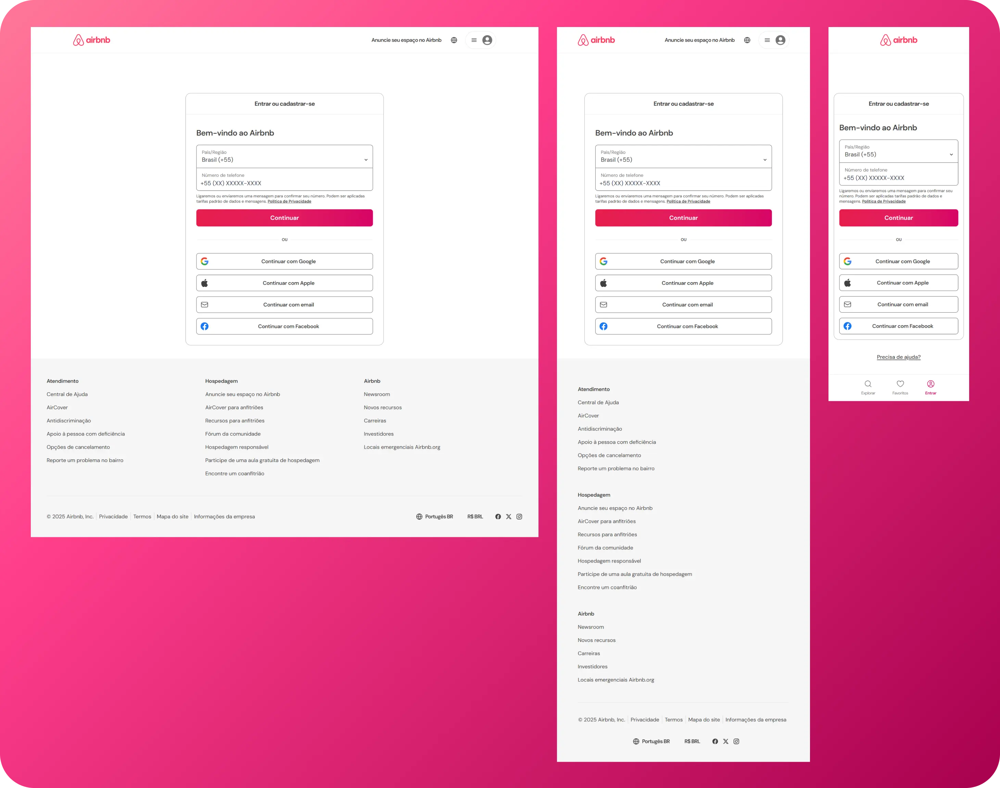

<div align="center">


</div>
<br>

<div align="center">

</div>

<h1 align="center">Clone Login Airbnb</h1>

### 📝 Sobre
Após concluir o curso **Tailwind CSS do Básico ao Avançado + Projetos**, da Comunidade Hora de Codar, em um dos projetos — que consistia na criação da página de login do Facebook — me desafiei a desenvolver um projeto semelhante, porém mais complexo, a fim de exercitar e aplicar diversas funcionalidades do **Tailwind CSS 4**.

---

### 🚀 UI e Deploy
<div align="center">
<p >
  
</p>

[→ Ver Projeto On-line 🔗](https://clone-login-airbnb.vercel.app/)

</div>

---

### 🧩 Principais Dependências

Este projeto foi construído com foco em produtividade, responsividade e boas práticas de estilização. As principais dependências utilizadas são:


- **[Tailwind CLI](https://tailwindcss.com/docs/installation/tailwind-cli)** – Para geração do CSS final a partir dos templates.
- **[PostCSS](https://postcss.org/)** e **[Autoprefixer](https://github.com/postcss/autoprefixer)** – Utilizados no processo de build dos estilos.
- **[Iconify para Tailwind](https://iconify.design/docs/usage/css/tailwind/tailwind4/)** – Para integração de ícones SVG com classes do Tailwind.
- **[Prettier](https://github.com/tailwindlabs/prettier-plugin-tailwindcss)** com **prettier-plugin-tailwindcss** – Padronização e ordenação automática das classes CSS.

Para a lista completa de dependências e versões, consulte o arquivo [`package.json`](./package.json).

---

## ▶️ Como Configurar o Projeto no VS Code:

### 📌 Pré-requisitos
Antes de prosseguir com a configuração, certifique-se de ter todos os pré-requisitos instalados corretamente para evitar erros durante a instalação e execução do projeto:

`Git 2.4+` `Node.js 12+` `Live Server` `Tailwind CSS IntelliSense`


### ⚙️ Configurando o Projeto

1. Clone este repositório:
Abra o **VS Code**, pressione `Ctrl + Shift + P`, digite **"Git Clone"** e cole o link do repositório:
```sh
https://github.com/domfabio/Clone-Login-Airbnb-Tw-CSS.git
```
2. Instalar Dependências:
```sh
npm install
```
3. Inicie o servidor de desenvolvimento:
```sh
npm run dev
```
4. Rodar o Projeto
Usando a extensão **Live Server**:<br>
Clique com o botão direito no `index.html` e selecione **"Open with Live Server"**.

---

## 🤝 Contribuição
**Se deseja contribuir, siga os passos:**
1. Fork o repositório
2. Crie uma branch: `git checkout -b feature-minha-feature`
3. Faça commit das suas mudanças: `git commit -m 'Minha nova funcionalidade'`
4. Faça push para a branch: `git push origin feature-minha-feature`
5. Abra um Pull Request

---

Este projeto é distribuído sob a [Open Source License - MIT](https://opensource.org/licenses/MIT). <br>Veja a documentação para mais detalhes.

